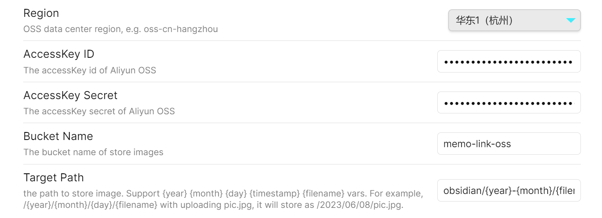

# **Image OSS Uploader for Obsidian**
🚀 **自动上传图片到阿里云 OSS** | 🔒 **安全存储** | ⚡ **无缝集成 Obsidian**

---

## **📖 简介**
**Image OSS Uploader** 是一款 **Obsidian 插件**，允许你直接将笔记中的图片（包括拖拽、粘贴或手动选择）**一键上传至阿里云 OSS（对象存储服务）**，并返回可访问的 URL。

- ✅ **快速上传** - 支持 `拖拽/粘贴/手动选择` 图片
- ✅ **安全存储** - 文件存储在阿里云 OSS，私有/公开可配置
- ✅ **路径自定义** - 自由选择 OSS 存储目录
- ✅ **无缝集成** - 直接在 Obsidian 中插入图片链接

---

## **🛠 安装**
### **方法 1：通过 Obsidian 社区插件市场（推荐）**
1. 打开 Obsidian → **设置** → **社区插件（Community Plugins）**
2. 搜索 **`Image OSS Uploader`** → 点击 **安装**
3. **启用插件** 并前往插件设置完成 **阿里云 OSS 配置**

### **方法 2：手动安装（开发版）**
1. 从 [GitHub Releases](https://github.com/renzhsh/image-oss-uploader/releases) 下载 `main.js` 和 `manifest.json`
2. 复制到 Obsidian 插件目录：`<你的Vault>/.obsidian/plugins/image-oss-uploader/`
3. 重新加载 Obsidian 并启用插件

---

## **⚙️ 配置说明**
配置前，请确保已开通 **阿里云 OSS**，并准备好 **AccessKey** 和 **Bucket 信息**。

### **🔑 必填参数**
| 配置项 | 描述 | 示例 |
|--------|------|------|
| **Region** | OSS 存储地域（Region ID） | `oss-cn-hangzhou` |
| **Bucket** | OSS 存储桶名称 | `your-bucket-name` |
| **AccessKey** | 阿里云 AccessKey ID | `LTAI5txxxxxxxxxxxx` |
| **SecretKey** | 阿里云 AccessKey Secret | `nRrXxxxxxxxxxxxxxxxxxxxxxxxxxxx` |

### **📁 可选参数**
| 配置项 | 描述 | 示例 |
|--------|------|------|
| **Target Path** | 存储路径（默认直接存 Bucket 根目录） | `images/`（自动补全 `/`） |

⚠ **注意**：
- **SecretKey 以密文存储**（Obsidian 配置文件是明文，建议使用子账号最小权限 AccessKey）。
- **Bucket 建议设为私有读**，避免公开访问（可配合 CDN 或 STS 临时令牌优化安全策略）。

**配置界面示例**：


---

## **🚀 使用方法**
### **1. 拖拽 / 粘贴图片上传**
- 截图后 **直接粘贴** 到 Obsidian 笔记
- 或 **拖拽本地图片** 到编辑区
- **自动上传并替换为 OSS URL**（默认格式：``）

### **2. 手动上传（命令面板）**
1. **`Ctrl/Cmd + P`** 打开命令面板
2. 搜索 **`Upload Image to OSS`** → 选择图片文件
3. 自动插入 Markdown 图片语法

---

## **💡 高级功能**
### **自定义 OSS 文件路径**
- **支持变量**（如日期、笔记名）：
  ```plaintext
  ${year}/${month}/${filename}
  ```
  **示例结果**：
  ```
  https://your-bucket.oss-cn-hangzhou.aliyuncs.com/2023/10/awesome-pic.png
  ```

### **批量替换本地图片**
运行命令 **`Replace local images with OSS links`**，可扫描笔记并替换所有本地图片为 OSS 链接（需谨慎备份！）。

---

## **❓ 常见问题**
### **Q1: 为什么上传失败？**
- 检查 **AccessKey / SecretKey** 是否正确
- 确认 **Bucket 权限** 允许写入
- 网络问题可尝试关闭代理或检查域名解析

### **Q2: 是否能私有 Bucket？**
- **支持**，但需额外配置 **CDN + URL 签名** 或 **STS 临时令牌**（后续版本计划支持）。

### **Q3: 是否支持其他云存储？**
- 当前仅支持阿里云 OSS，**七牛云 / AWS S3 / 腾讯云 COS 等可提 Issue 需求**。

---

## **📜 开源协议**
MIT License | Copyright © 2023 [Your Name]
代码仓库：[GitHub - Image OSS Uploader](https://github.com/renzhsh/image-oss-uploader)

**欢迎贡献！** 🌟 提交 PR 或 Issue 反馈问题/建议。

---
**让 Obsidian 图片管理更高效！** 🎉